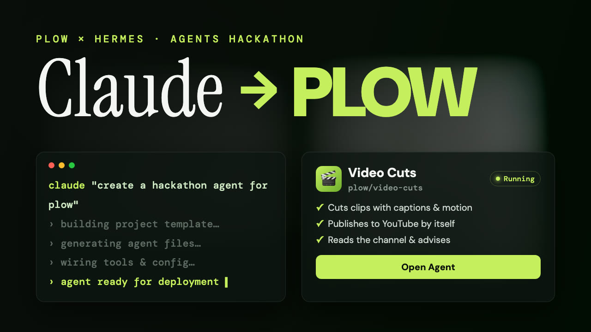
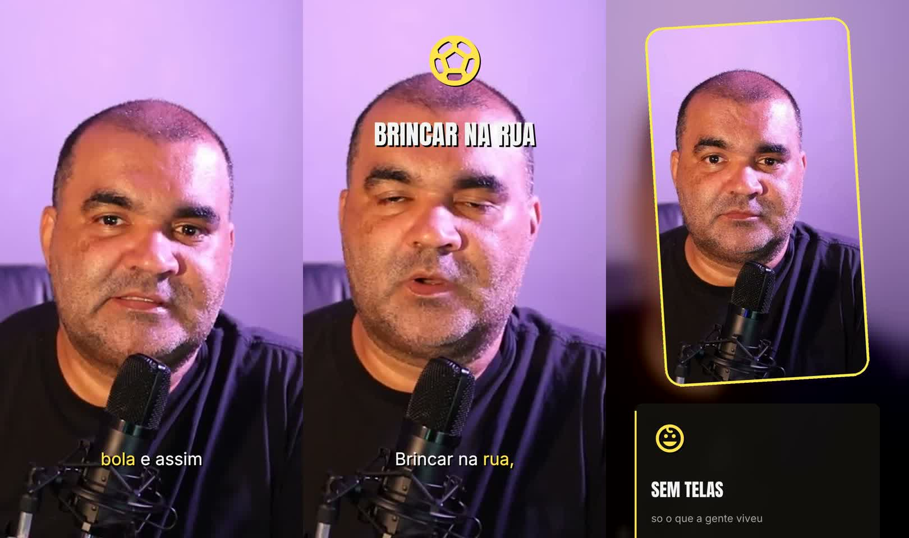
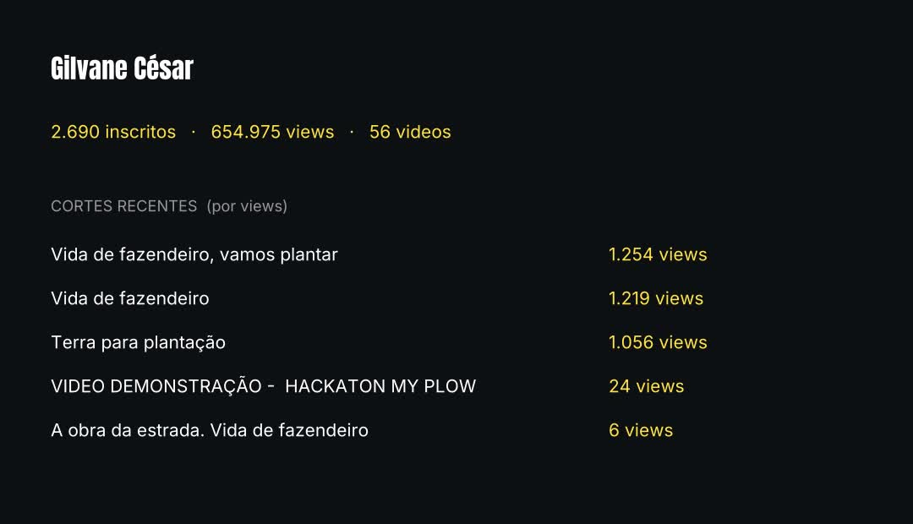
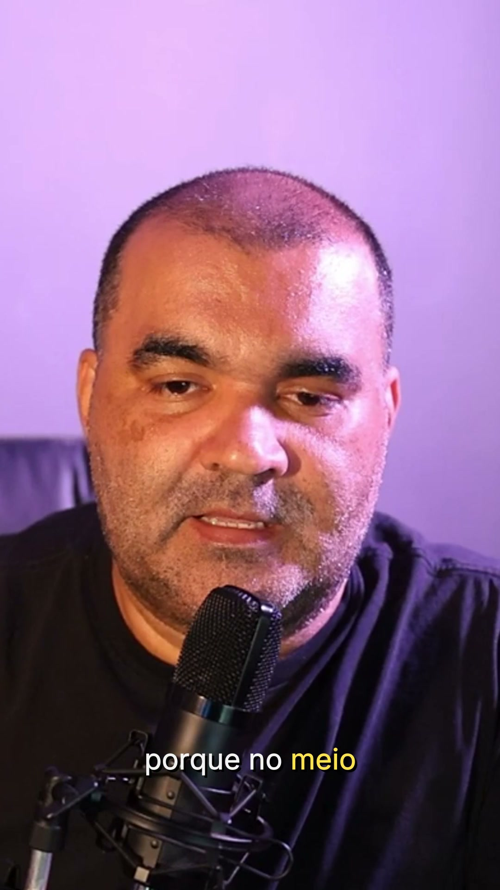

<h1 align="center">Video Cuts</h1>

<p align="center">
  <b>An agent with a phone number that turns your recordings into published clips —<br>
  and remembers everything you have ever said.</b>
</p>

<p align="center">
  <a href="https://aiworthusing.com/agent-index/dailies">Agent Index</a> ·
  <a href="docs/INSTALL.md">Install</a> ·
  <a href="#how-it-works">How it works</a> ·
  <a href="https://youtu.be/8cYmeKaYD-8">Watch the demo</a> ·
  Built for the <a href="https://luma.com/3uftu95w">Hermes Hackathon</a>
</p>

<p align="center">
  <a href="https://youtu.be/8cYmeKaYD-8">
    
  </a>
  <br><b><a href="https://youtu.be/8cYmeKaYD-8">▶&nbsp; Watch a real run — raw file to published clip, in ~90 seconds</a></b>
  <br><i>No montage. A recording dropped in a folder, asked for over iMessage, transcribed on the Mac,<br>cut to horizontal with captions and motion, and published to YouTube — by the agent.</i>
</p>

---

You finish recording and walk away. By the time you look at your phone, the
thinking is done and one decision is waiting.

Text it a YouTube link or drop a recording in a folder. Video Cuts transcribes
it **on your own machine**, finds the moments that stand on their own, and texts
you the angles to choose from. You answer with one word. It cuts — vertical and
horizontal, framed on your face, opening on the strongest line, with captions,
icons and motion it chose — and, when you say yes, publishes straight to
YouTube. No editor. No browser. No upload dialog.

<p align="center">
  
  <br><i>One clip, cut and captioned by the agent — animated keyword · titled card · picture-in-picture frame.</i>
</p>

## What makes it different

Every clipping tool is stateless: it sees one upload, cuts it, forgets it.
Video Cuts keeps a **topic index across everything you record**. So it does what
none of them can:

- *"Where did I talk about my kids?"* → the exact sentence, the timestamp, and an offer to cut it.
- *"How is the channel doing?"* → real numbers, read live from your YouTube, crossed with your own topics — and a read on **which angle actually works**: *"your 'family in the 90s without phones' clips are 90% of the channel's views — that is the angle that works for you."* That sentence needs both the performance data and the topic memory; nothing else has both.

<p align="center">
  
  <br><i>The channel, answered over iMessage — live from the YouTube Data API, never estimated.</i>
</p>

## How it works

The agent **thinks** in a container; the work **happens** on your Mac, and
publishing goes straight to YouTube's API. Between the agent and your Mac sits
[Plow Latch](https://plow.co/latch), which approves each reach.

```
  your phone ──iMessage──▶  Plow line ──▶  Hermes agent (Docker)
                                              │
                              ┌───────────────┼────────────────┐
                              ▼               ▼                ▼
                        Latch (approved)   plowcut         YouTube Data API
                        your Mac:          transcribe ·    upload · thumbnail ·
                        whisper · ffmpeg   cut · index     channel stats
```

Two ways in, one engine:

| | **Cloud** | **Mac** |
|---|---|---|
| install | one click, nothing to download | one command |
| input | text it a **link** | drop a file in a folder |
| transcription | faster-whisper, in the container | whisper.cpp, on your Mac |
| framing | centre crop | **follows your face** (macOS Vision, no model download) |
| big files, YouTube publish | — | ✓ |

The same `plowcut` runs on both sides; only the transcription backend differs,
and the transcript shape is identical, so topic-finding, hooks, captions and
motion never know the difference.

## What a recording becomes

1. **Noticed** — once the file stops growing, or fetched from the link you sent.
2. **Transcribed** on your machine, word by word. Nothing is uploaded.
3. **Segmented into topics**, and the standalone moments inside each are found.
4. **Texted to you** as angles. You pick one.
5. **Cut** — vertical + horizontal, face-framed, opening on the hook, with
   word-by-word captions, keyword pops, titled cards, a picture-in-picture
   frame, and a slow push-in. A thumbnail is pulled from the clip itself.
6. **Published** to YouTube through the Data API when you 👍 — numbered `#1`,
   `#2`, … in order, private until you make it public.
7. **Remembered** — the clip is tied to its topic, so *"how did the family one
   do?"* has an answer later.

<p align="center">
  
  <br><i>The thumbnail: a real frame from the clip, never an AI-made image.</i>
</p>

## The clip vocabulary

The agent composes the edit like an editor, choosing what a beat needs — not a
fixed template. It has:

- **keyword** — a short line lands on screen the instant it is spoken, with an optional icon (≈3,600 [Material Symbols](https://fonts.google.com/icons), asked for by name).
- **card** — a titled panel that names a thing the speaker only implies.
- **frame** — you shrink into a rounded, tilted card and the graphic takes the space you freed.
- **lower_third**, **punch / pull** (camera lunge), **flash**, **push-in**.

Typography is [Anton](https://fonts.google.com/specimen/Anton) + [Inter](https://fonts.google.com/specimen/Inter); the whole graphic layer is one `libass` pass, so a 34-second clip renders in seconds.

## Install

One command on the Mac, then a phone line. Full walk-through, written for
someone who has never seen this repo: **[docs/INSTALL.md](docs/INSTALL.md)**.

```sh
git clone https://github.com/gilvanecesar/video-cuts.git && cd video-cuts
sh mac/install.sh          # ffmpeg, whisper, model, fonts, face framing — idempotent
```

`plowcut status` afterwards checks each piece it needs and, for anything
missing, says exactly how to fix it.

## Publishing to YouTube

Publishing uses the **YouTube Data API**, not a browser — Latch's browser drives
Playwright, which cannot attach a file, so the API is the only path that truly
uploads. You connect your channel once, from your phone, with the device flow:

```
[agent] "Go to google.com/device and enter WHJ-KKC-WBQD"
[you]   approve on your phone, once
```

Reading the channel and uploading are network-only, so they run in the agent's
container, not on your Mac — *"how is the channel doing?"* answers instantly,
even with your Mac asleep. After that every upload is silent. The agent never sees a password; the OAuth
token is stored per-owner and never leaves your machine. While the app is
unverified, clips land **private** and you make them public in one tap — which
is also the last consent you want to have.

## What it will not do

- Publish anything without an explicit yes, about that clip.
- Upload your footage anywhere. Transcription is local.
- State a number it did not measure. No views yet? It says none — it never
  dresses a guess as data.

## The Plow tools it uses

- **[Latch](https://plow.co/latch)** — approved, sandboxed access to your Mac.
- **[hermes-plow-plugin](https://github.com/plow-pbc/hermes-plow-plugin)** — the agent's phone line.
- **[agent-index-client](https://github.com/plow-pbc/agent-index-client)** — usage reporting, an hourly s6 service.

## Under the hood

| Path | What |
|---|---|
| `mac/plowcut` | the Mac/container tool — `fetch · ready · transcribe · cut · index · search · pending · yt-connect · yt-upload · yt-stats · archive` |
| `mac/yt_upload.py` | YouTube Data API: device-flow OAuth, resumable upload, thumbnail, channel stats — standard library only |
| `mac/facefind.swift` | face detection via the macOS Vision framework, no model download |
| `mac/install.sh` | one-command, idempotent setup |
| `runtime/SOUL.md` | the persona and the hard rules |
| `skills/dailies-*` | intake · clips · publish · ask — where the judgment lives |

## Licence

MIT — see [LICENSE](LICENSE).
